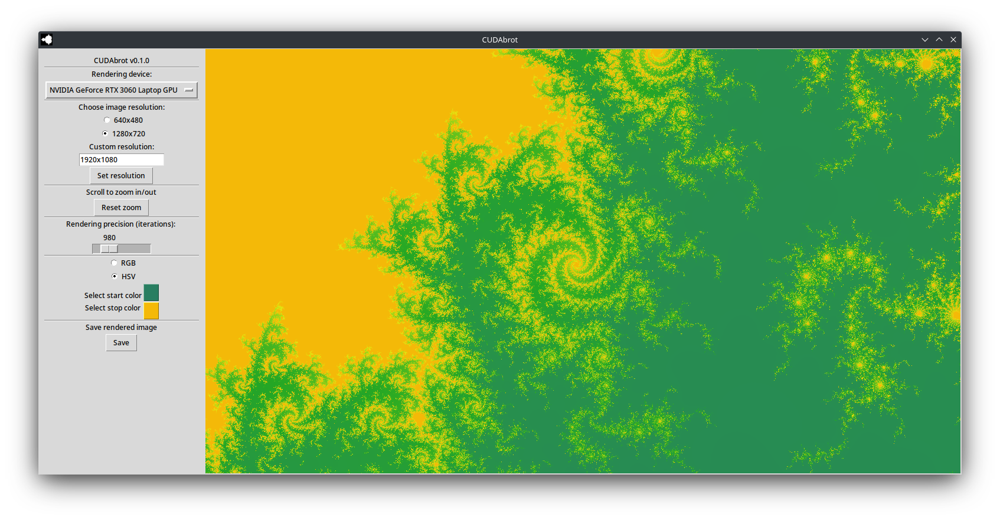

# CUDAbrot

CUDAbrot is a simple GUI tool for rendering the Mandelbrot fractal. Meant mainly as a learning project.



## Installation

Install the following packages: Pytorch, Tkinter, Pillow, Numpy

```bash
pip3 install torch tk Pillow numpy
```

Note: to enable CUDA rendering, torch needs to be installed with proper support, see [installation instructions](https://pytorch.org/get-started/locally/).


## Usage

Just run the .py file

```bash
python3 cudabrot.py
```

## To be done
- optimization
